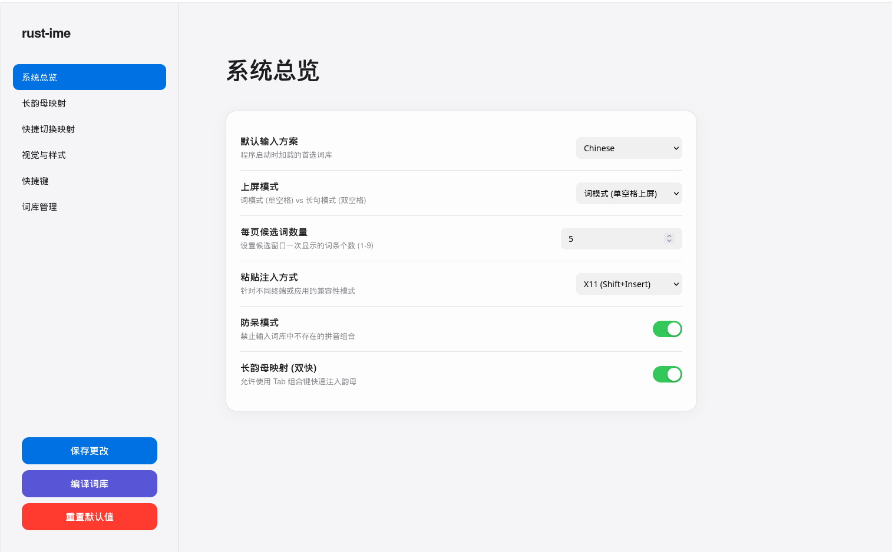

# rust-ime 使用手册

这是一个专为 Linux 设计的高性能、现代化中文输入法引擎。采用 Rust 编写，深度适配 Wayland/COSMIC 桌面环境，提供极致的丝滑盲打体验。

---

## ⚠️ 已知局限 (Known Limitations)

虽然 rust-ime 在很多方面表现出色，但目前仍有一个显著的局限性：

**候选窗无法跟随光标 (Fixed Position Only)**
- **描述**：由于本程序采用底层 `evdev` 拦截机制，而非传统的输入法框架协议（如 Fcitx5/IBus），输入法引擎无法直接获取目标应用内光标的精确像素坐标。
- **现状**：候选窗目前只能固定在屏幕的特定位置（如底部居中、左下角等）。
- **建议**：用户可以在网页配置中心根据自己的屏幕布局调整候选窗的固定位置，以获得最佳的视觉平衡感。

---

## 🖥️ 桌面环境支持情况 (Compatibility)

由于使用了 `gtk4-layer-shell` 技术，本程序在不同桌面环境下的表现如下：

| 桌面环境 | 状态 | 说明 |
| :--- | :--- | :--- |
| **KDE Plasma (Wayland)** | ✅ 完美 | 核心测试环境，体验最佳。 |
| **COSMIC (Wayland)** | ✅ 完美 | 核心测试环境，深度适配。 |
| **Hyprland / Sway** | ✅ 支持 | 基于 wlroots 的合成器通常表现良好。 |
| **GNOME (Wayland)** | ⚠️ 受限 | 候选窗可能无法置顶或显示为普通窗口。 |
| **所有 X11 桌面** | ⚠️ 受限 | 界面层协议不支持，UI 体验可能下降。 |

> **提示**：即使 UI 无法显示，底层的“盲打”逻辑（注入、辅码、快捷键）依然在所有环境中有效。

---

## 🚀 核心灵魂特性 (Key Features)

### 1. 长韵母快捷输入 (Quick Rime / Tab 双快)
**借鉴小鹤音形设计，实现全拼速度的跨越。**
- **设计哲学**：保留全拼的拼写直觉，通过 `Tab` 键赋予按键“双重角色”。
- **操作方式**：按住 `Tab` 键的同时按下对应字母，瞬间注入长韵母（如 `Tab+L` -> `uang`）。
- **优势**：大幅减少击键次数，比传统双拼更易上手，比纯全拼快一倍以上。

### 2. 英文辅码：零重码精准筛选 (English Auxiliary Code)
**调用本能的英文知识实现零重码盲打。**
- **设计哲学**：拼音解决“音”，英文辅码解决“义”。
- **展示选项**：可在网页配置中心自由开启或关闭 **“汉字注音”** 和 **“英文释义”**。
- **操作方式**：输入拼音后，直接输入大写字母或单词片段（如 `liI` -> `里` Inside）。

### 3. 智能防呆模式 (Anti-Typo)
**禁止输入不存在的拼音，让输入流永不断裂。**
- **逻辑**：实时校验当前片段。如果输入了错误的组合（如 `gog`），非法按键将被自动拦截。
- **反馈**：拦截发生时，系统会播放错误提示音（可配置），提供即时反馈。

### 4. 快捷切换模式 (Quick Switch)
**不再需要循环点击，一键直达目标方案。**
- **操作方式**：按下反引号 **`` ` ``** 键进入模式，按 `c` 换中文，`e` 换英文等。
- **自动退出**：切换完成后自动回到输入状态，效率极高。

---

## 🛠 其他核心功能

### 1. 上屏模式切换 (Commit Mode)
- **词模式 (Word Mode)**：单击 `Space` 立即上屏首选。
- **长句模式 (Sentence Mode)**：单击 `Space` 锁定分词，双击 `Space` 或 `Enter` 上屏。
- **快捷切换**：按下 `Alt + Space` 快速切换。

### 2. 混合 UI 体验
- **传统候选窗**：经典的横向选词列表。
- **卡片式候选窗**：现代感十足的卡片悬浮设计。
- **按键显示**：在屏幕角落实时回显物理按键，辅助调试与展示。

---

## ⌨️ 默认快捷键 (Default Hotkeys)

| 快捷键 | 功能描述 |
| :--- | :--- |
| **`Caps Lock`** | 切换 **中文** / **直通 (无输入法)** 模式 |
| **`Alt + Space`** | **切换上屏模式 (词模式 / 长句模式)** |
| **`` ` (反引号) ``** | **进入快捷切换模式 (一键切词库)** |
| **`Tab + Letter`** | **长韵母快捷注入 (Quick Rime)** |
| **`← / →`** | **移动光标 / 循环选择候选词** |
| **`1 - 9`** | **数字选词 (仅词模式下直接上屏)** |
| **`Enter`** | 确认预览词上屏 |
| **`Space`** | 上屏 (词模式) / 手动分词 (长句模式) |
| **`Ctrl + Alt + G`** | 显示 / 隐藏 **传统候选窗** |
| **`Ctrl + Alt + H`** | 显示 / 隐藏 **卡片式候选窗** |
| **`Ctrl + Alt + K`** | 开启 / 关闭 **按键显示** |
| **`Ctrl + Alt + V`** | 切换自动粘贴模式 (Shift+Ins / Ctrl+V) |

---

## 📦 安装与发布 (Installation)

1. 下载最新的 `rust-ime-linux-x64.tar.gz` 并解压。
2. 进入目录，右键点击“在终端打开”。
3. 输入 `bash ./install.sh` 并按回车。
4. **重启电脑** 即可开始使用。

---

## 👨‍💻 AI 使用心得

在使用 Gemini 开发这个项目的过程中，我有一些非常深刻的体会：AI 的天花板往往是由使用者的水平决定的。对于专业、小众的技术挑战，如 Wayland 协议或复杂的 N-Gram 算法，AI 容易陷入逻辑死循环或过度设计。**人的鉴别力依然是不可逾越的最后一道防线。**
